### 0x01 需要准备的东西
- AOSP : N2G47O_android-7.1.2_r8
- Xposed源码 : https://github.com/rovo89
- 编译工具 : AndroidStudio
到https://github.com/rovo89把需要的五个项目都下载下来<br/>
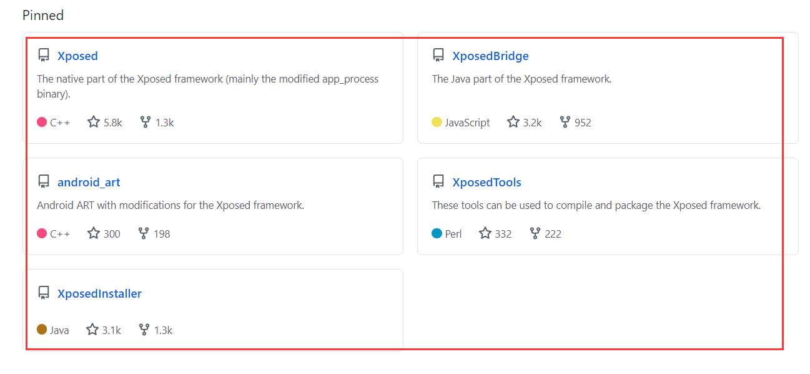<br/>
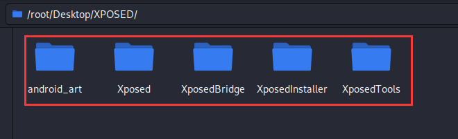<br/>

### 0x02 编译XposedBridge
1.使用AndroidStudio打开下载下来的XposedBridge工程，AndroidStudio要我们安装什么我们就安装什么<br/>
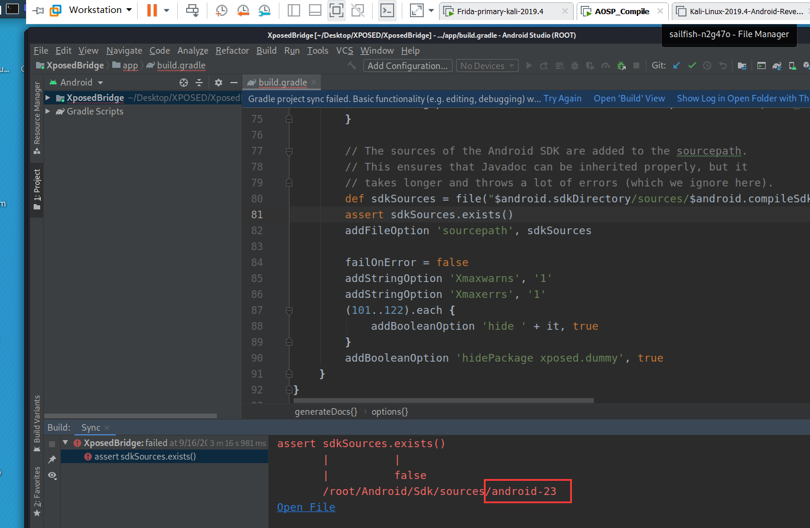<br/>
2.出现以上错误的原因是我们没有sdk23，所以我们需要下载sdk23<br/>
<br/>
3.安装完skd23后，任然会报错
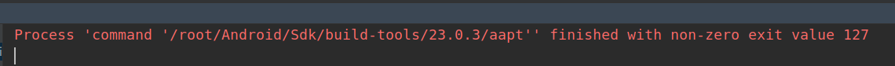<br/>
4.这时候需要我们安装lib32z1<br/>
```
apt install lib32z1
```
5.等待项目没有报错，我们就开始编译<br/>
```
Build → Make Project
```
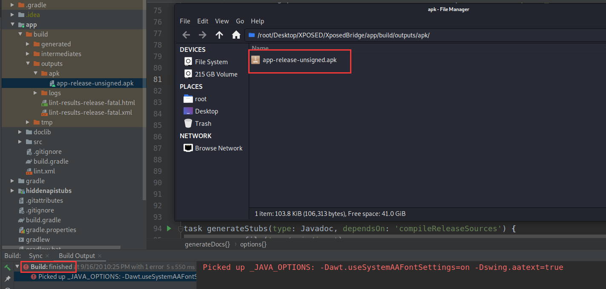<br/>
6.上图就是我们编译出来的文件，把编译出来的app-release-unsigned.apk重命名为XposedBridge.jar<br/>

### 0x03 编译android_art
1.aosp源码中的art文件夹剪切出来，放到aosp文件夹的上层目录即可<br/>
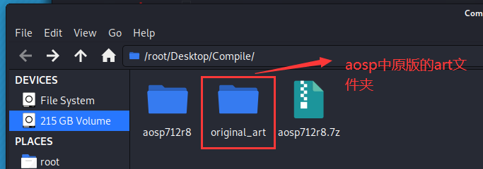<br/>
2.把下载下来的android_art文件拷贝到aosp源码中，并修改为art<br/>
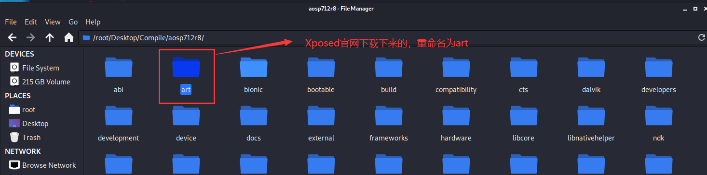<br/>
3.开始编译<br/>
```
source build/envsetup.sh
lunch
18
make -j8
```

### 0x04 编译Xposed
编译Xposed倒是非常轻松，只需要将其放在源码的指定目录中即可，XposedTools会自动找到它进行编译。<br/>
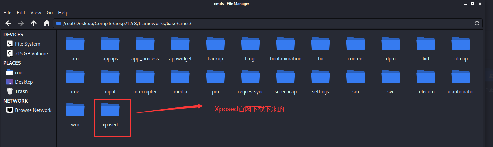<br/>


### 0x05 编译XposedTools
1.将编译出来的XposedBridge.jar拷贝到aosp根路径下的/out/java/目录，注意java目录需要我们手动创建<br/>
<br/>
2.将文件夹内的编译配置模板拷贝一份<br/>
```
cp build.conf.sample build.conf
```
3.对build.conf进行配置<br/>
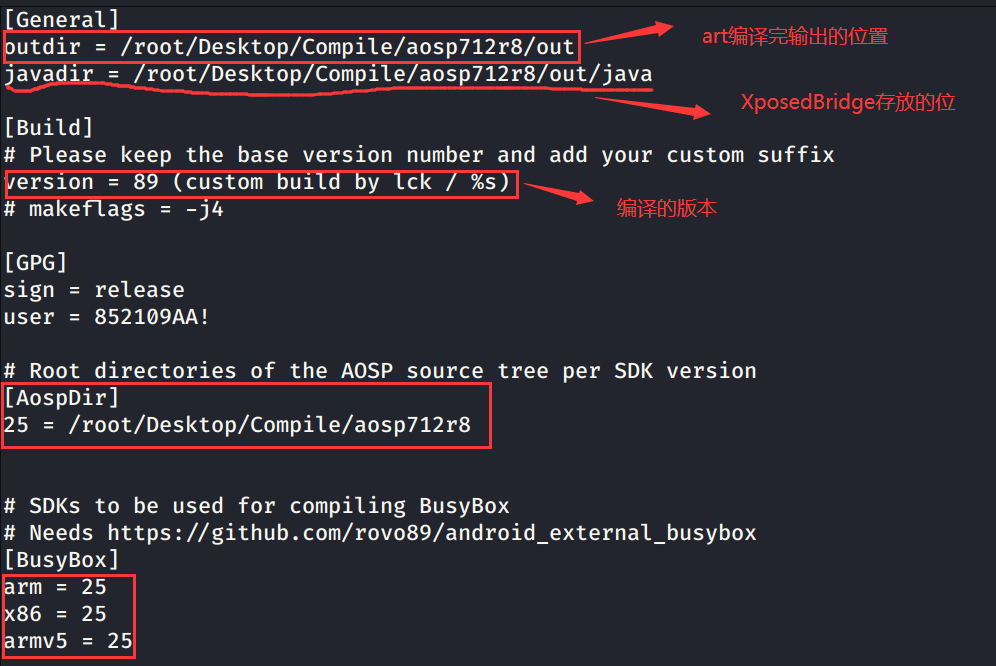<br/>
4.XposedTools使用的是perl开发环境，需要安装一系列的perl环境及三方包，首先安装环境<br/>
```
apt install libconfig-inifiles-perl libauthen-ntlm-perl libclass-load-perl libcrypt-ssleay-perl libdata-uniqid-perl libdigest-hmac-perl libdist-checkconflicts-perl libfile-copy-recursive-perl libfile-tail-perl
```
5.全部安装完成之后，再使用perl的包管理器安装第三方工具包<br/>
```
# perl -MCPAN -e 'install Config::IniFiles'
# perl -MCPAN -e 'install File::Tail'
# perl -MCPAN -e 'install File::ReadBackwards'
```
6.最后还会有一个perl -MCPAN -e 'install Archive::Zip'在安装时会一直报错，这时可以使用cpan命令进入命令行模式，输入install Archive::Zip命令来手动安装Archive::Zip包。<br/>
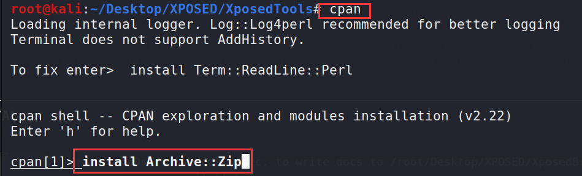<br/>
7.以上全部准备完毕之后，直接编译即可，注意要在XposedTools/这个文件夹里面<br/>
```
# ./build.pl -t arm64:25
```
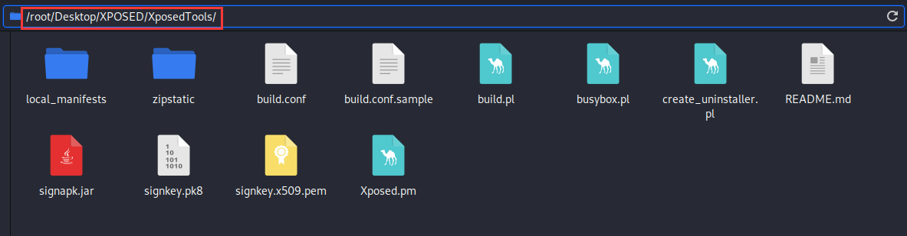<br/>
编译完成之后，输出在out/sdk25/arm64/这个目录下面<br/>
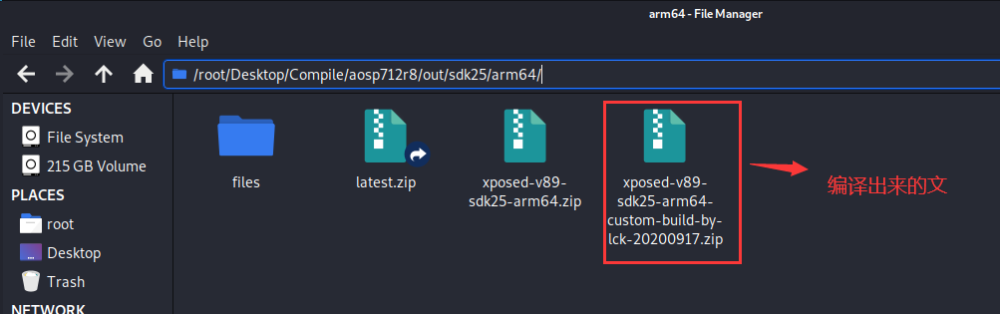<br/>


### 0x06 搭建Web服务器
1.为了让XposedInstaller使用我们编译出来的Xposed刷机包，我们需要在kali中搭建一个web服务器<br/>
2.使用lighttpd服务器<br/>
```
apt install lighttpd
service lighttpd start
```
3.测试是否成功<br/>
查看kali的ip地址<br/>
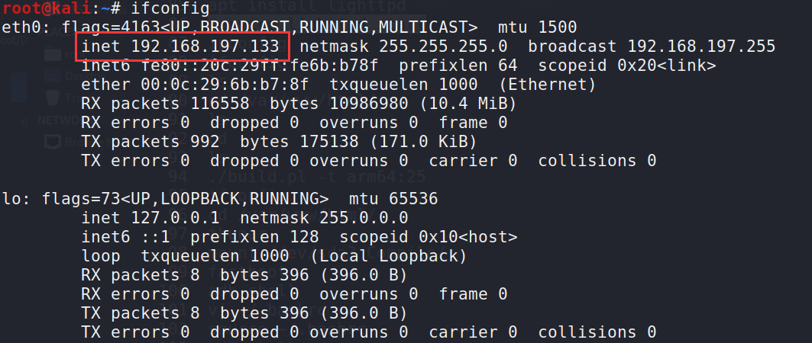<br/>
访问ip地址，查看web服务器是否成功开启<br/>
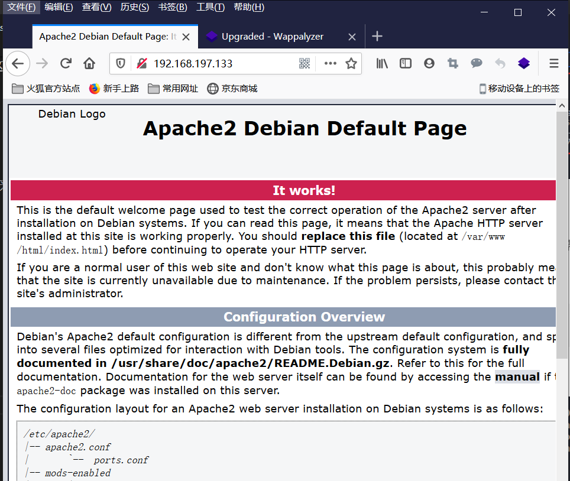<br/>
出现Apache的默认界面表示成功<br/>
4.把编译出来的刷机包拷贝到/var/www/html/目录下，并重命名为xposed-v89-sdk25-arm64.zip<br/>
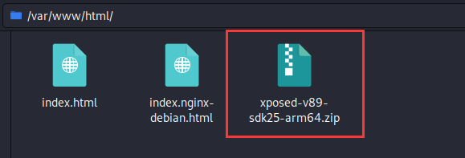<br/>


### 0x07 编译XposedInstaller
1.把下载下来的XposedInstaller用AndroidStudio打开，AndroidStudio提示我们安装什么我们就安装什么，直到项目不再报错<br/>
2.修改下载刷机包的url地址，让这个url指向我们自己编译出来的刷机包，需要修改的文件为app/src/main/java/de/robv/android/xposed/installer/util/DownloadsUtil.java<br/>
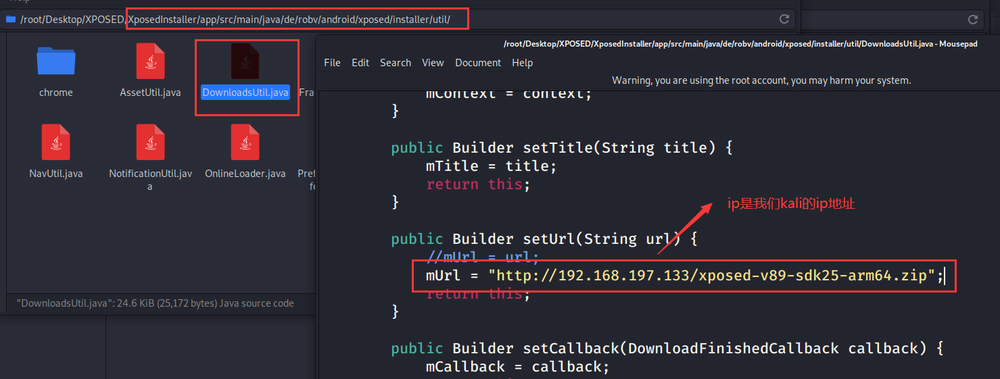<br/>


### 0x08 刷机
直接运行XposedInstaller这个项目，将编译出来的apk安装到手机上，然后点击下载，这样XposedInstaller就会到我们自己搭建的服务器上寻找我们自己编译出来的刷机包，最后等待自动刷机完毕再重启即可<br/>
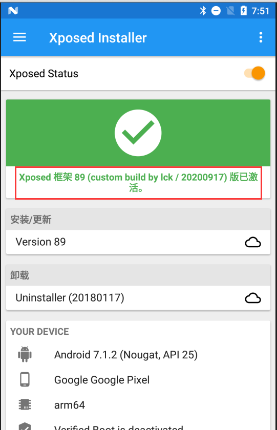<br/>
显示上图，即表示刷机成功！<br/>

