### 0x01配置虚拟机环境
1.通过种子文件[kali-linux-2019-4-vmware-amd64-zip.torrent](./kali-linux-2019-4-vmware-amd64-zip.torrent)，下载kali虚拟机，下载下来之后解压用VMware解压<br/>
2.修改虚拟机的配置，把内存调到12G，硬盘给到280G<br/>
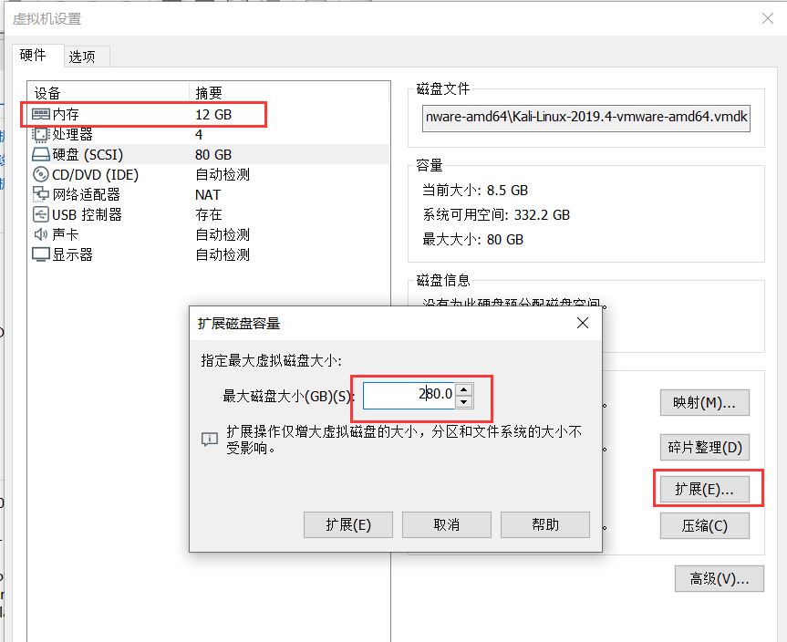<br/>
3.接下来，把刚才我们添加的200G空间应用到磁盘并挂载到文件夹上<br/>
4.首先进入系统，打开Gparted软件<br/>
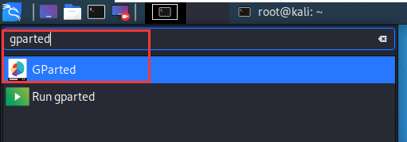<br/>
5.划分我们刚刚添加的200G空间，选中unallocated部分右击，选择新建，按照默认即可，即可新建这个200G的ext4分区，点击选择Apply，应用到磁盘。<br/>
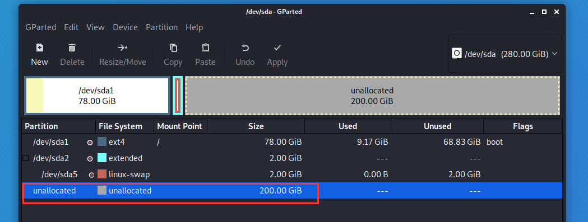<br/>
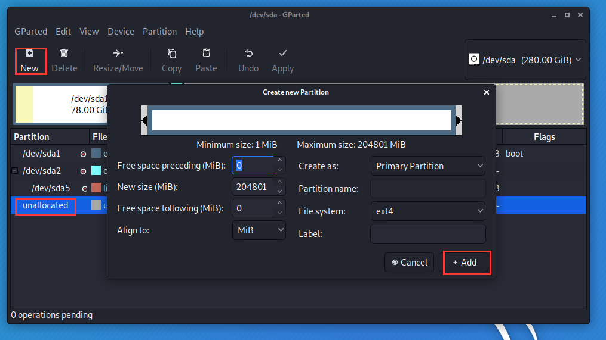<br/>
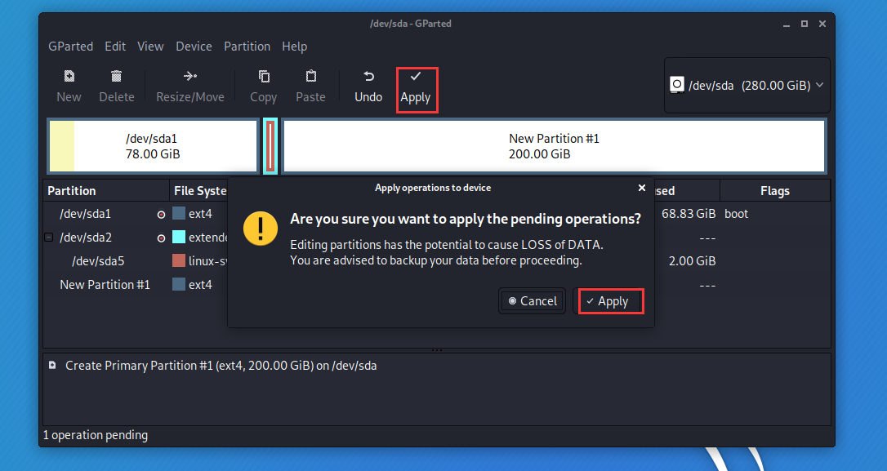<br/>
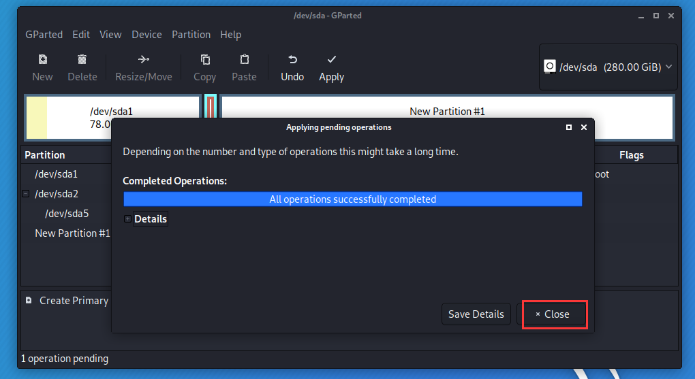<br/>
6.使用fdisk -l查看是否新建分区成功，如下图所示，分区新建成功<br/>
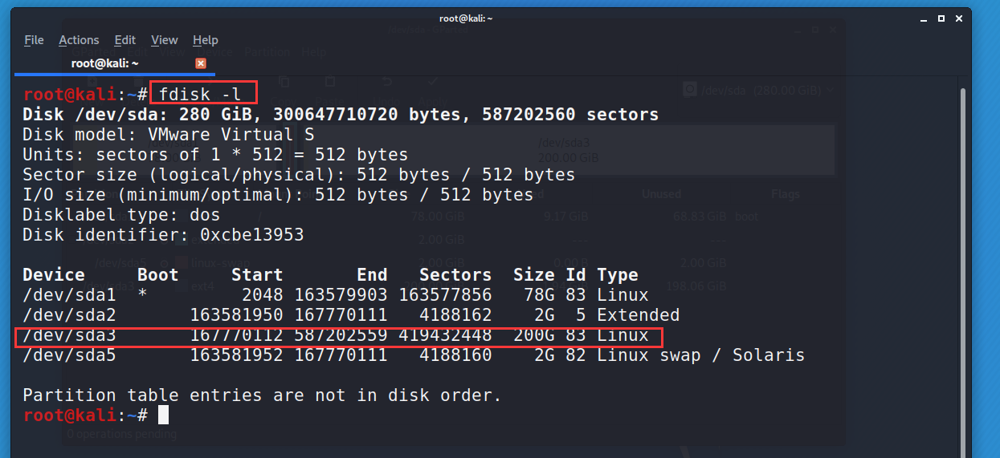<br/>
7.然后将这个新建的磁盘给mount到某个文件夹<br/>
```
cd ~/Desktop
mkdir Compile
mount /dev/sda3 Compile/
```
8.修改kali的锁屏策略，让其不要休眠，防止编译的时候出现休眠情况<br/>
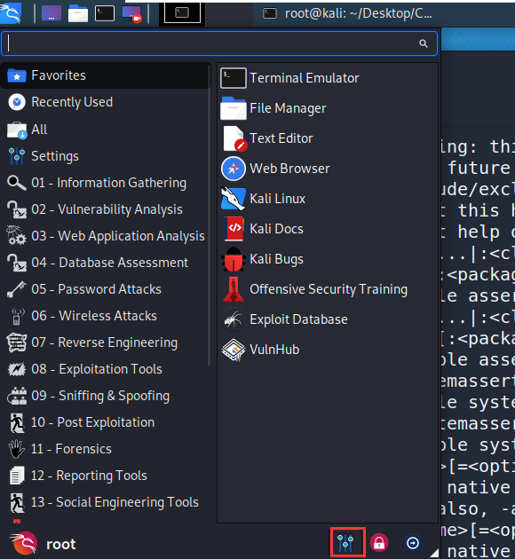<br/>
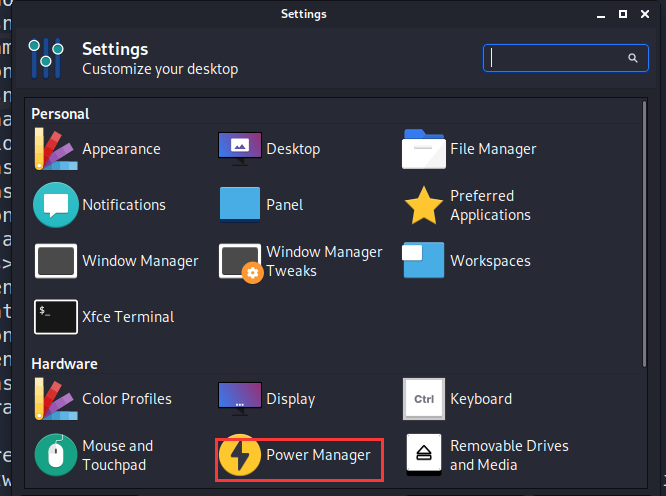<br/>
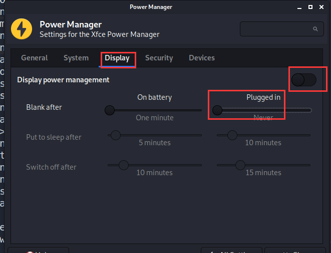<br/>
按照上面3张图操作即可<br/>


### 0x02准备编译环境
1.安装编译环境<br/>
```
# apt update
# apt install bison tree
# dpkg --add-architecture i386
# apt update
# apt install libc6:i386 libncurses5:i386 libstdc++6:i386
# apt install libxml2-utils
```
运行apt install libc6:i386 libncurses5:i386 libstdc++6:i386会出现下图情况，选择yes即可<br/>
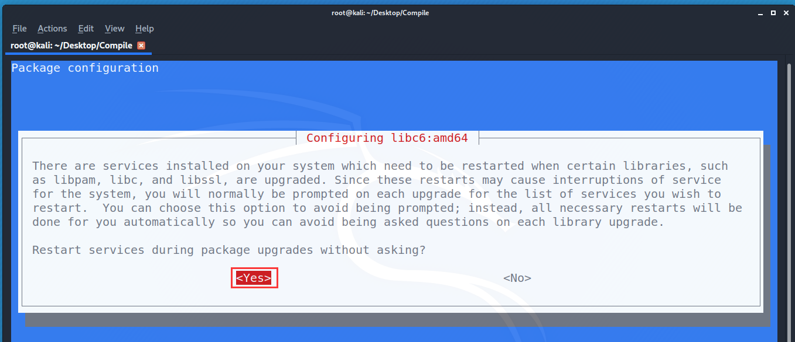<br/>

2.增加swap空间。为了防止编译的时候内存不够，我们给swap加10G<br/>
```
dd if=/dev/zero of=swapfile bs=1M count=10240
mkswap swapfile
```
激活交换分区<br/>
```
swapon swapfile
```

3.安装openjdk8。系统内置的openjdk 11太新了，会报错，装个官网要求的openjdk-8<br/>
```
apt install openjdk-8-jdk
```
输入以上命令，报错如下：<br/>
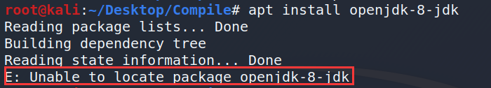<br/>
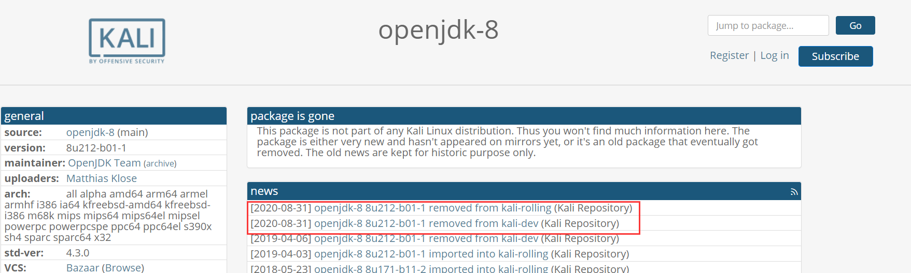<br/>
查了下资料，得知，kali竟然移除了openjdk8，难受了~~~。那就只能手动安装了<br/>

### 0x03手动安装openjdk8
1.访问这个网站提供的jdk。这网站提供jdk的不用安装，直接解压就可以使用，下载Oracle Linux 7.6 x64 Java Development Kit (md5) 167 MB这个文件<br/>
```
https://jdk.java.net/java-se-ri/8-MR3
```
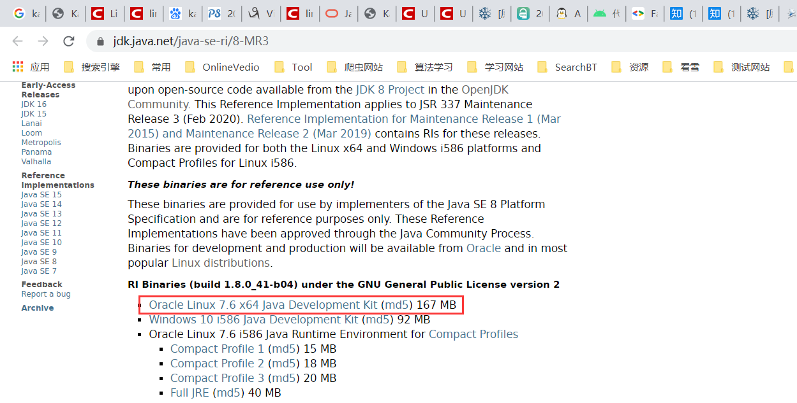<br/>
2.下载完之后把文件拷贝到kali中并进行解压<br/>
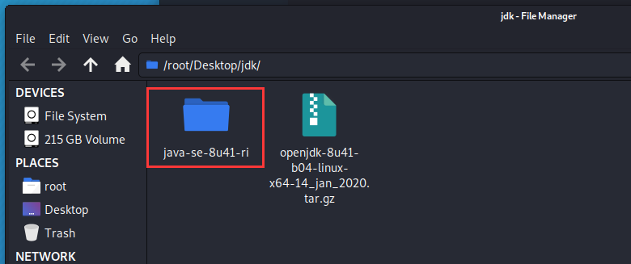<br/>
3.开始配置环境变量，使用vi打开/etc/profile这文件，根据你自己解压出来的路径进行设置环境变量，我的是这样的：<br/>
```
JAVA_HOME=~/Desktop/jdk/java-se-8u41-ri
PATH=$JAVA_HOME/bin:$PATH
CLASSPATH=.:$JAVA_HOME/lib/dt.jar:$JAVA_HOME/lib/tools.jar:$JAVA_HOME/jre/lib/rt.jar
export JAVA_HOME
export PATH
export CLASSPATH
```
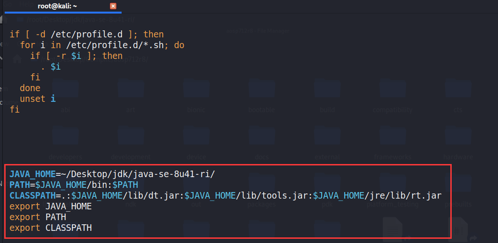<br/>
使修改的配置立刻生效<br/>
```
source /etc/profile 
```
对~/.bashrc这个文件也执行上述一样的操作，然后使用命令查看是否成功<br/>
```
java -version
javac -version
```
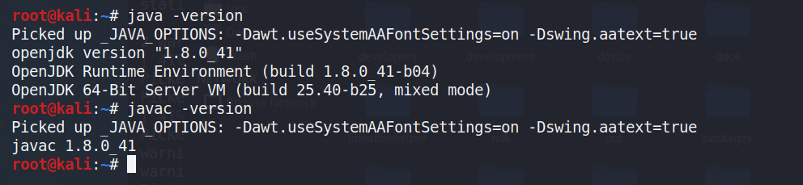<br/>
显示上图效果表示安装成功<br/>

### 0x04准备源码
1.因为公司的网络实在太慢了，导致我几次都没有下载下来，所以最后还是用了肉丝大佬提供的源码<br/>
2.访问这个百度云链接，下载aosp712r8的源码<br/>
```
链接：https://pan.baidu.com/s/1yQL0nOLMlw6MVR0uNaa1pQ 
提取码：benx
```
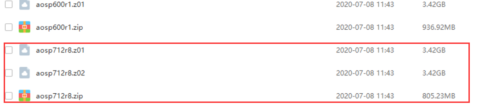<br/>
3.下载下来之后，解压aosp712r8.zip这个文件夹，然后把解压出来的内容拷贝到kali中，并解压<br/>
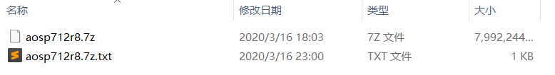<br/>
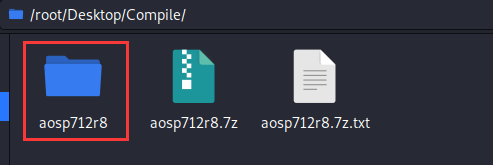<br/>
4.然后我们访问下面这个网站，下载对应的驱动<br/>
```
https://developers.google.com/android/drivers
```
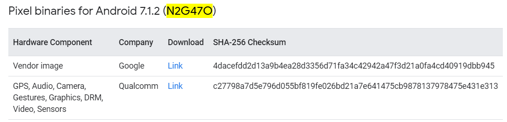<br/>
5.把下载下来的驱动复制到kali中的aosp路径下<br/>
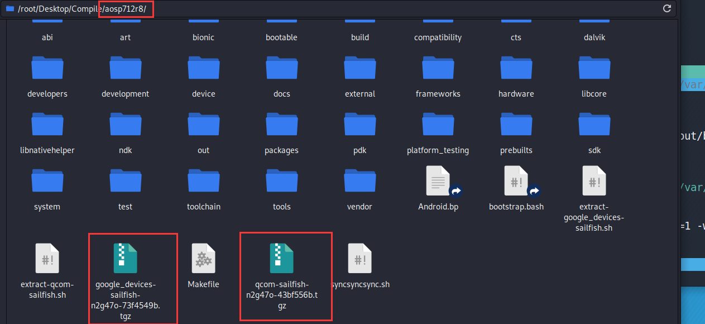<br/>
解压文件，并运行解压出来的文件<br/>
```
tar zxvf google_devices-sailfish-n2g47o-73f4549b.tgz 
tar zxvf qcom-sailfish-n2g47o-43bf556b.tgz

./extract-google_devices-sailfish.sh 
./extract-qcom-sailfish.sh 
```

### 0x05开始编译
cd到aosp路径<br/>
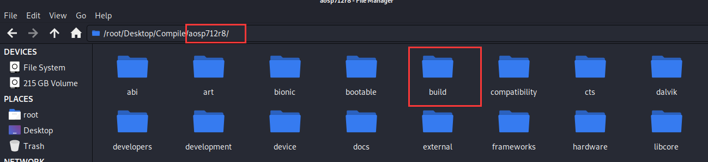<br/>
运行命令<br/>
```
source build/envsetup.sh
```
使用lunch选择设备，因为我使用的Pixel所以选择18<br/>
```
lunch
```
开始编译，有多少个核心就是j几<br/>
```
make -j8
```
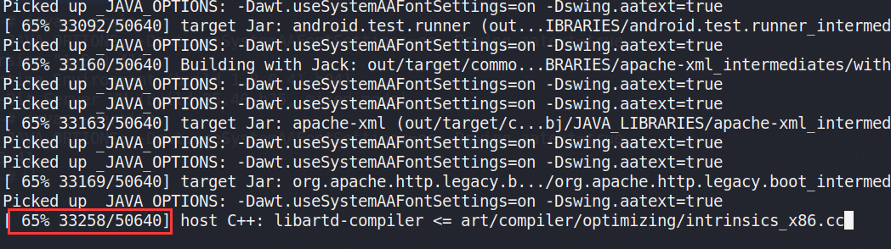<br/>
等待上图执行到100%就编译完成了<br/>


### 0x06刷机
1.到下面这个网站下载7.1.2_r8的镜像<br/>
```
https://developers.google.com/android/images
```
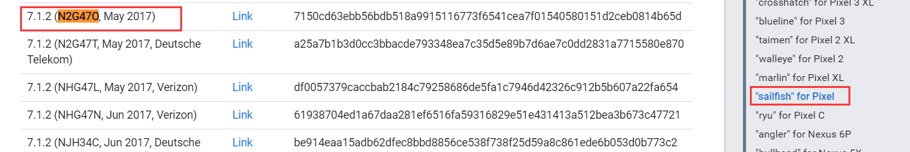<br/>
2.下载下来的镜像拷贝到kali中解压，解压完之后再解压image-sailfish-n2g47o.zip这个文件到image-sailfish-n2g47o文件夹下<br/>
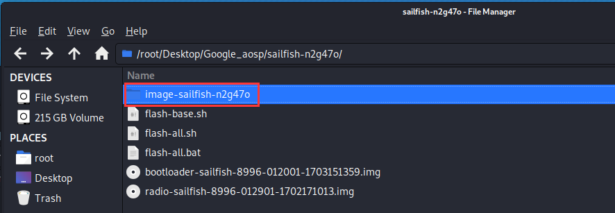<br/>
3.进入image-sailfish-n2g47o文件夹，删除所有文件，除了android-info.txt这个文件<br/>
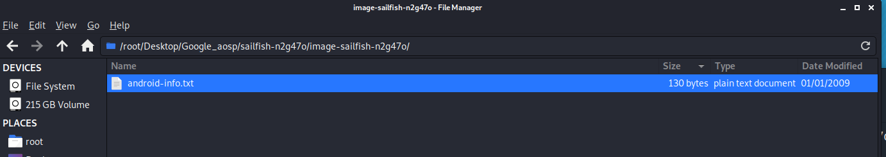<br/>
4.拷贝我们编译出来的镜像到image-sailfish-n2g47o这个文件夹下<br/>
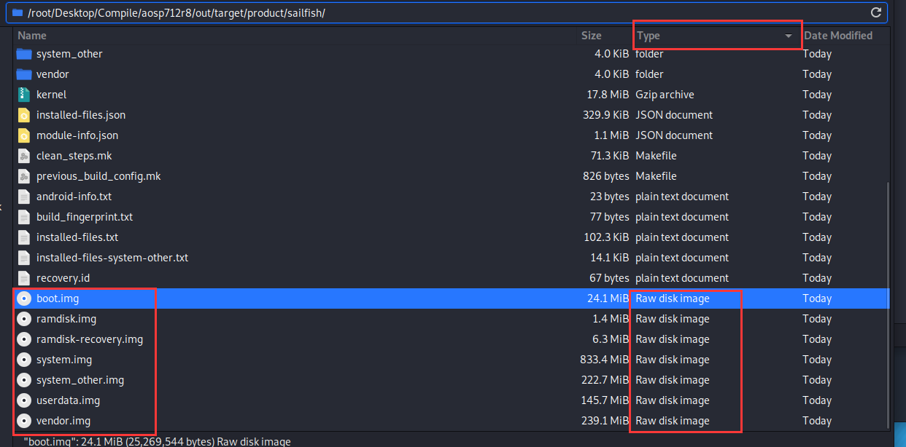<br/>
5.把image-sailfish-n2g47o这个文件夹打包<br/>
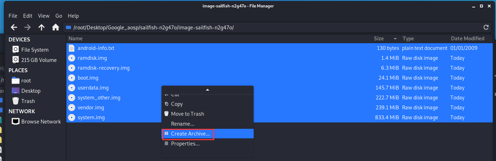<br/>
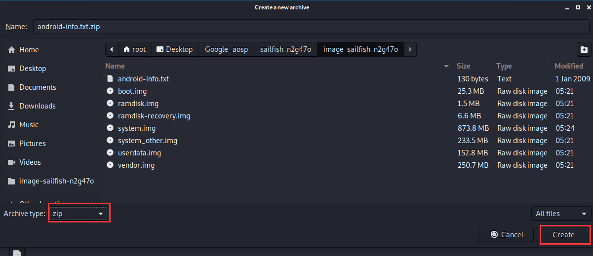<br/>
6.打完包之后把打包之后的文件移动到和flash-all.sh这个文件同级的地方，并重命名为image-sailfish-n2g47o.zip<br/>
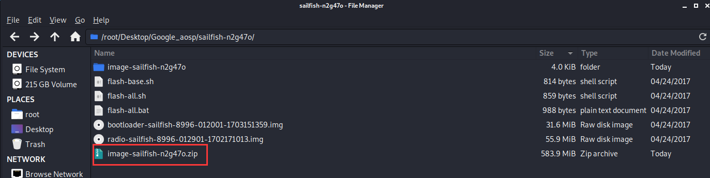<br/>
7.连接上手机，进入BootLoader模式，运行./flash-all.sh命令进行刷机<br/>

##### fastboot加入环境变量
因为，在编译完源码之后，我虚拟机卡死了导致我重启了虚拟机，出现了找不到fastboot这个错误，所以需要把fastboot加入到环境变量中，首先寻找fastboot的位置<br/>
```
tree -NCfh | grep fastboot
```
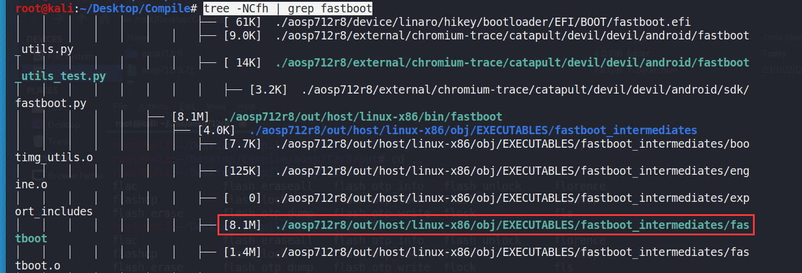<br/>
把fastboot临时加入到环境变量中<br/>
```
export PATH=~/Desktop/Compile/aosp712r8/out/host/linux-x86/obj/EXECUTABLES/fastboot_intermediates:$PATH
```
测试是否成功<br/>
```
fastboot
```
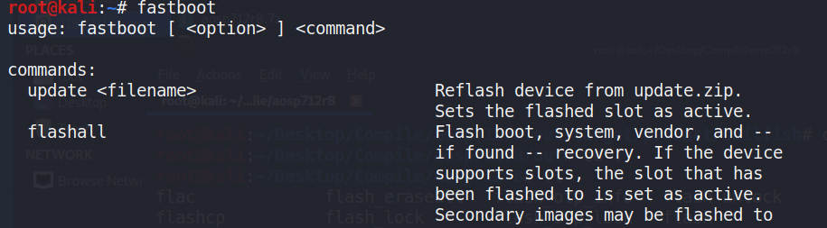<br/>
出现上图内容，即成功<br/>

8.再次运行./flash-all.sh命令<br/>
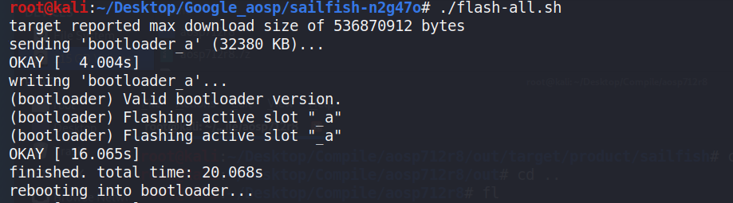<br/>
出现上图内容，等待运行完毕，然后开启手机<br/>
<br/>
手机成功开机，刷机成功！！！<br/>


### 0x07总结
坑一：kali的软件源中的openjdk8被移除了，需要我们手动安装openjdk8<br/>
坑二：重启之后控制台无法使用fastboot，这时候需要把编译出来的fastboot加入到临时环境变量中才能成功刷机<br/>


