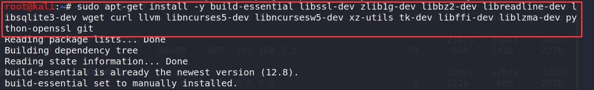
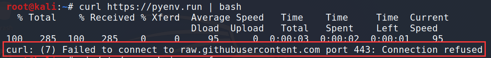
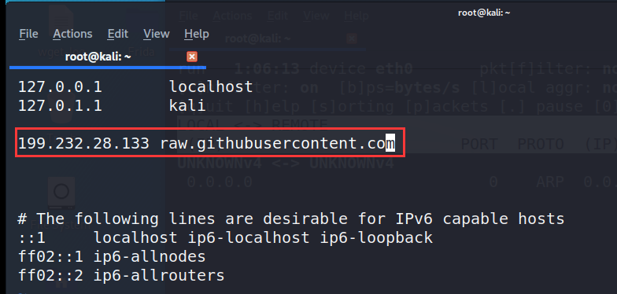
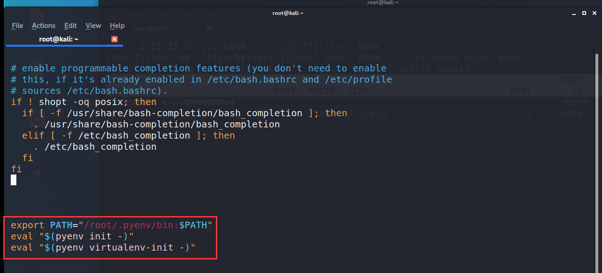
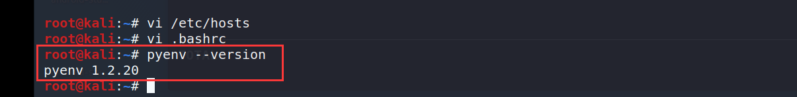

## 安装依赖
访问https://github.com/pyenv/pyenv-installer查看安装的方法，发现需要先安装依赖 : 
- Ubuntu/Debian:
```
sudo apt-get install -y build-essential libssl-dev zlib1g-dev libbz2-dev \
libreadline-dev libsqlite3-dev wget curl llvm libncurses5-dev libncursesw5-dev \
xz-utils tk-dev libffi-dev liblzma-dev python-openssl git
```
那我们就先安装依赖，在kali的shell中输入以上命令，等待安装完毕


## 使用命令进行安装
输入命令 : 
```
curl https://pyenv.run | bash
```
可能会产生以下错误：

原因大概是因为github的dns被污染了，需要找到git真实的ip加在hosts里面，经过我的测试，raw.githubusercontent.com对应的IP为：199.232.28.133，所以需要我们修改hosts文件：<br/>
```
vi /etc/hosts
```

等待上面的命令结束之后，使用vi打开baserc
```
vi .bashrc
```
将以下内容拷贝到最后面
```
export PATH="$HOME/.pyenv/bin:$PATH"
eval "$(pyenv init -)"
eval "$(pyenv virtualenv-init -)"
```

接着输入命令
```
source ~/.bashrc
```
这样pyenv就安装完成了，使用下面的命令检测一下
```
pyenv --version
```

出现pyenv的版本信息，pyenv安装成功！！！

