## 使用自定义的Frida版本
### 在PC上进行的操作
有的时候我们需要使用指定版本的Frida，不想使用最新版，那么就需要在下载的时候指定Frida版本。<br/>
首先，我们使用pyenv安装一个全新的python环境，比如python的3.7.7版本，输入命令pyenv install 3.7.7(如果不知道pyenv如何安装可以去看这篇文章——[kali安装pyenv](../kali安装pyenv/KaliLinux搭建pyenv.md))
```
pyenv install 3.7.7
```
等待python安装完成之后，开始指定版本Frida下载，比如现在我们想要下载Frida的12.8.0这个版本。<br/>
首先到这个网站查看对应关系https://github.com/frida/frida/releases
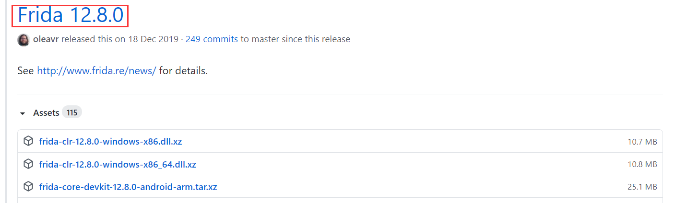
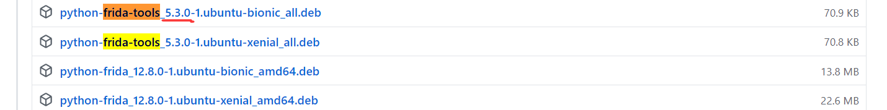
经过查询，可知Frida12.8.0版本对应的frida-tools为5.3.0，那么我们下载的时候指定这两个版本即可:
```
pip install frida==12.8.0
pip install frida-tools==5.3.0
```
等待安装完毕，输入frida --version查看版本信息。
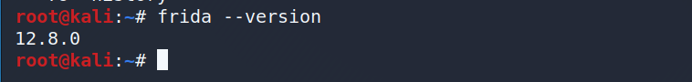
### 在手机上进行的操作
接下来需要我们再手机上安装frida-server<br/>
首先，我们需要确定我们手机的架构，输入以下命令：
```
adb shell getprop ro.product.cpu.abi
```
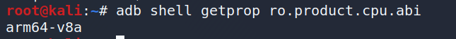
经过查询可知，我手机的架构是arm64，所以我们需要下载frida-server-12.8.0-android-arm64.xz这个文件。如果查询出来不知道架构，可以谷歌搜索一下。
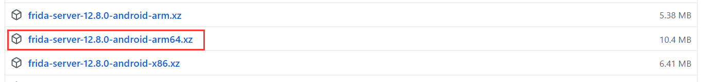
解压下载下来的文件，并重命名为fs-12-8-0
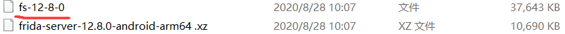
使用adb命令把fs-12-8-0放到/data/local/tmp下
```
adb push fs-12-8-0 /data/local/tmp
```
把fs-12-8-0文件修改为可执行文件
```
adb shell
su
cd /data/local/tmp
chmod 777 fs-12-8-0                                        
```
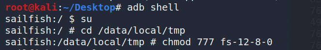
运行frida-server
```
./fs-12-8-0
```
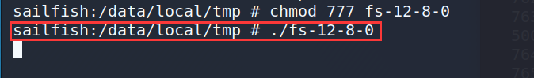
手机连接电脑，输入命令查看是否安装成功：
```
frida-ps -U
```
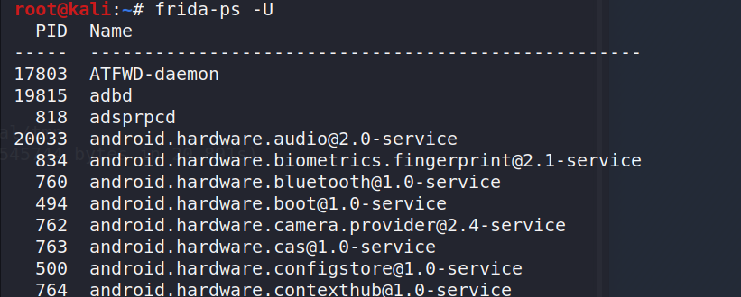
出现手机上运行的程序，frida安装成功！！！

## 自定义Frida端口
### 使用WIFI ADB
首先我们先安装wifiadb.apk这app到手机上，安装包就在当前目录。安装完毕后打开wifi adb并启动。
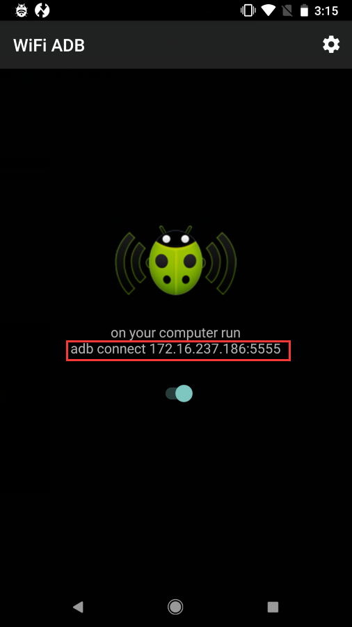
可以看到连接的地址为172.16.237.186:5555，所以我们输入adb命令进行连接：
```
adb connect 172.16.237.186:5555
```
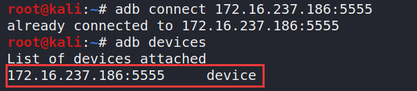
测试是否连接成功：
```
adb shell
```
如果成功进入手机shell，那么连接就成功了！
### 指定frida-server的端口
首先进入/data/local/tmp文件夹下：
```
adb shell
su
cd /data/local/tmp
```
指定frida-server监听的端口，比如我们选择8888这个端口：
```
./fs-12-8-0 -l 0.0.0.0:8888
```

然后我们再使用frida-tool进行连接：
```
frida-ps -H 172.16.237.186:8888
```
**注意这里的IP地址(172.16.237.186)，是你自己wifi adb上的地址**，端口是你指定的frida-server的端口，刚才我们指定的是8888，所以这里要填8888。
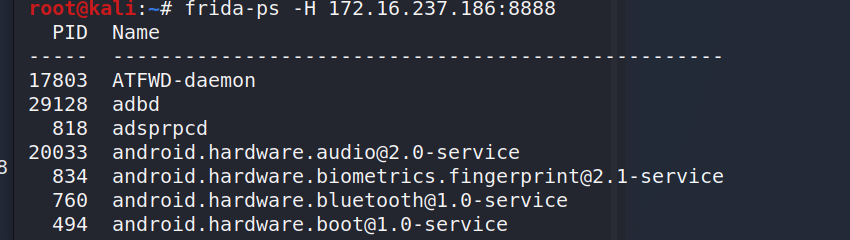
出现了手机上运行的程序，指定frida端口运行成功！！！


