## 环境一：Pixel_sailfish_7.1.2_r8 + Supersu + xposed 
需要用到的资料<br/>
```
链接：https://pan.baidu.com/s/1lZTWRrAJ1M8vzhscnCCAvQ 
提取码：tffw
```
#### 刷7.1.2_r8系统到Pixel
1.下载官方镜像，可以使用我百度盘链接里面下载好的镜像，也可以到Google的官方网站进行下载<br/>
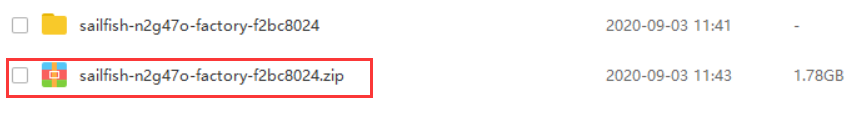<br/>
Google官网下载<br/>
```
https://developers.google.com/android/images#sailfish
```
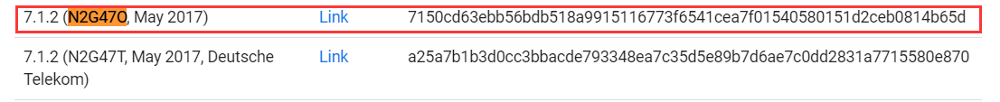<br/>

2.拷贝到kali虚拟机并进行解压，进入解压之后的文件夹，连接上手机，然后控制台运行./flash-all.sh命令进行刷机<br/>
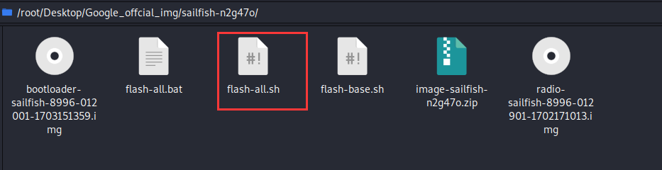<br/>
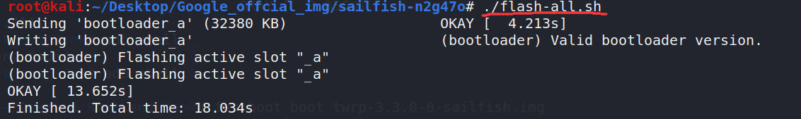<br/>

3.执行完上面的命令之后等待刷机完成即可<br/>

#### 刷Supersu到系统
1.下载对应的twrp镜像，同样可以使用我提供的镜像，或者到twrp的官网进行下载<br/>
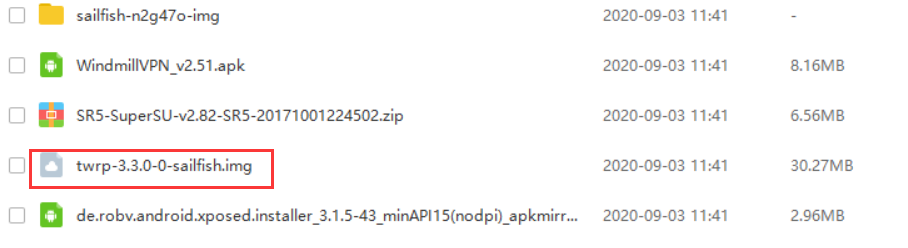<br/>
twrp官网
```
https://twrp.me/
```

2.下载Supersu，由于官网已经无法下载，所以直接使用我提供的，或者你可以在百度上找<br/>
3.把下载下来的Supersu传到手机的sdcard下面<br/>
```
adb push SR5-SuperSU-v2.82-SR5-20171001224502.zip /sdcard
```
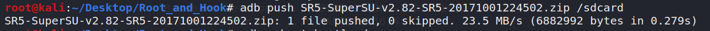<br/>

4.手机进入BootLoader模式<br/>
```
adb reboot bootloader
```

5.使用临时的twrp<br/>
```
fastboot boot twrp-3.3.0-0-sailfish.img
```
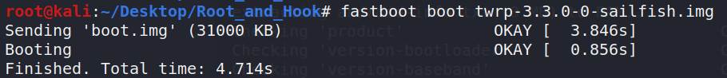<br/>

6.在临时的twrp中安装SuperSu<br/>
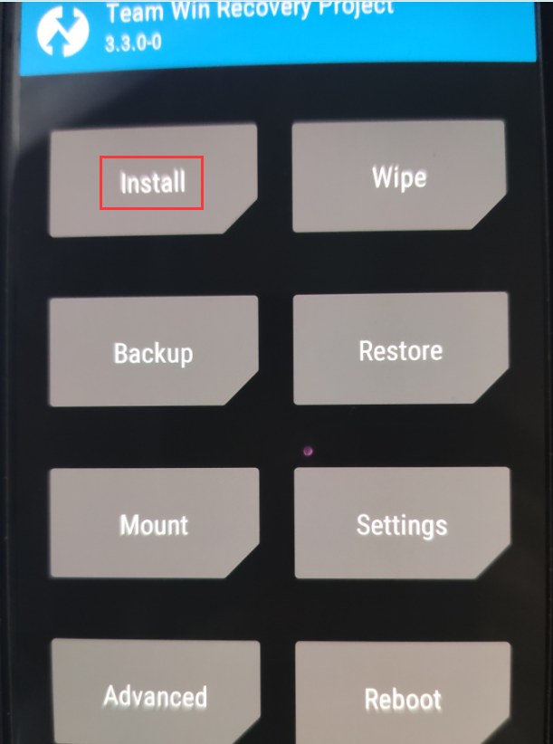<br/>
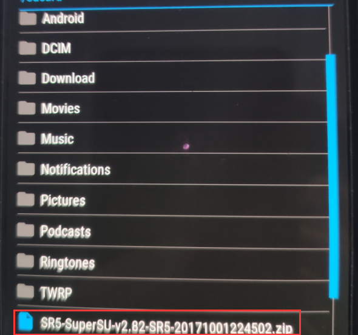<br/>
<br/>
等待刷入之后重启系统，能看到SuperSu的图标即刷入成功<br/>

#### 刷Xposed到系统
1.下载Xposed的安装包，并安装到手机<br/>
2.打开安装好的Xposed，点击安装/更新直接通过网络下载的方式进行安装。有可能出现网速过慢的情况导致下载不下来，这时候使用科学上网就OK了。<br/>
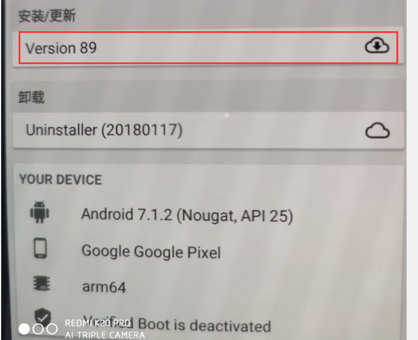<br/>


## 环境二：Pixel_sailfish_8.1.0_r1 + Magisk
1.首先查询8.1.0_r1对应的BuildId<br/>
```
https://source.android.com/setup/start/build-numbers
```
经过查询得知8.1.0_r1对应的BuildId为OPM1.171019.011<br/>
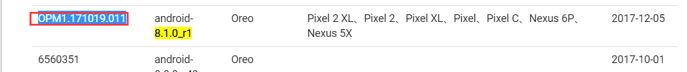<br/>

2.到Google官网下载8.1.0_r1的镜像<br/>
```
https://developers.google.com/android/images#sailfish
```  
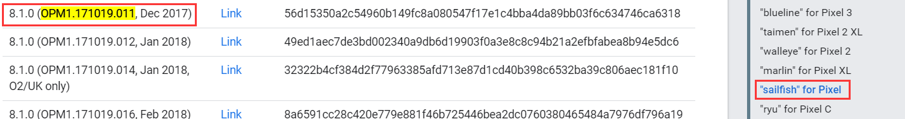<br/>

3.下载Magisk<br/>
```
https://github.com/topjohnwu/Magisk/releases
```
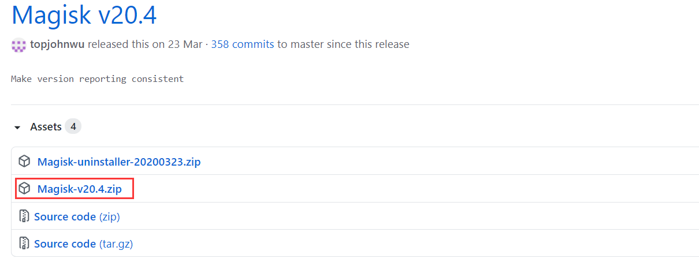<br/>

4.把镜像和Magisk拷贝到kali<br/>
5.刷机和上面一样，解压下载下来的镜像，然后运行./flash-all.sh命令即可刷机<br/>
6.刷Magisk和上方刷SuperSu一样，也是首先把下载下来的Magisk传递到手机的sdcard下，然后让手机进入BootLoader模式，接着进入临时的twrp，最后在install选项里面进行安装即可，具体操作步骤参考环境一<br/>


## 环境三：N6P_angler_8.1.0 + addonsu
1.下载需要的资料<br/>
```
链接：https://pan.baidu.com/s/1Nh1tLmdKx_pWwYpqJ52vaQ 
提取码：aac6
```
2.手机先进入BootLoader模式<br/>
```
adb reboot bootloader
```
把twrp刷入手机<br/>
```
fastboot flash recovery twrp-3.3.1-0-angler.img
```
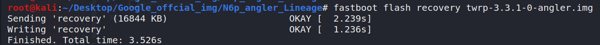<br/>

3.按音量下键，进入recovery<br/>
4.选择Wipe -> Format Data -> yes<br/> 
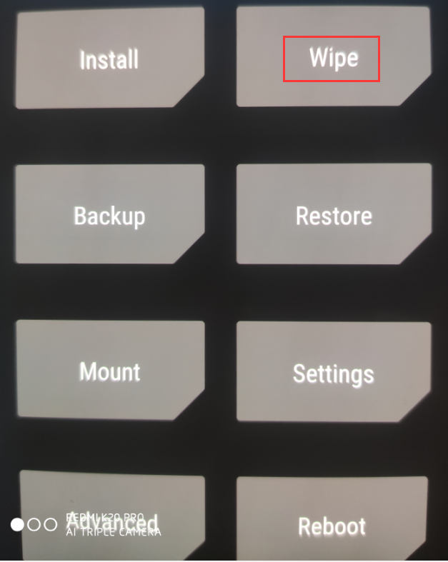<br/>
<br/>
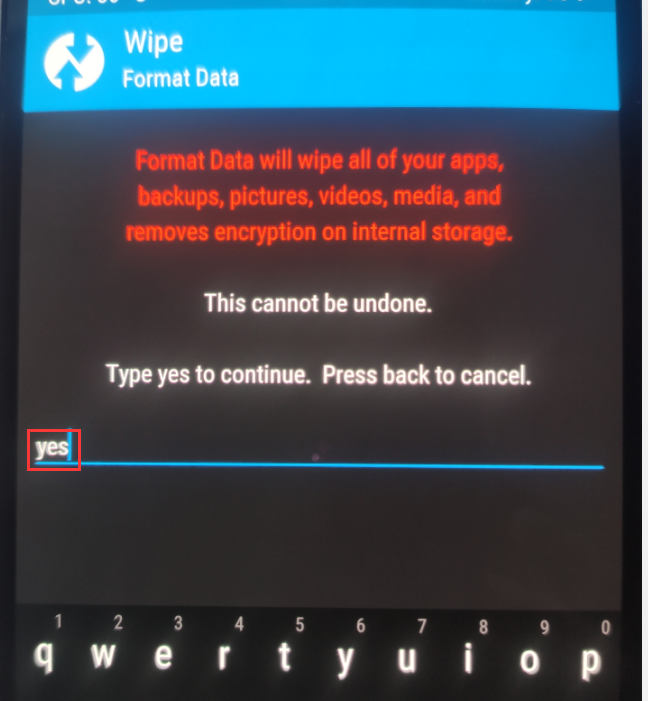<br/>
5.返回到开始界面，Wipe -> Advanced Wipe -> System , Cache -> Swipe to Wipe<br/>
<br/>
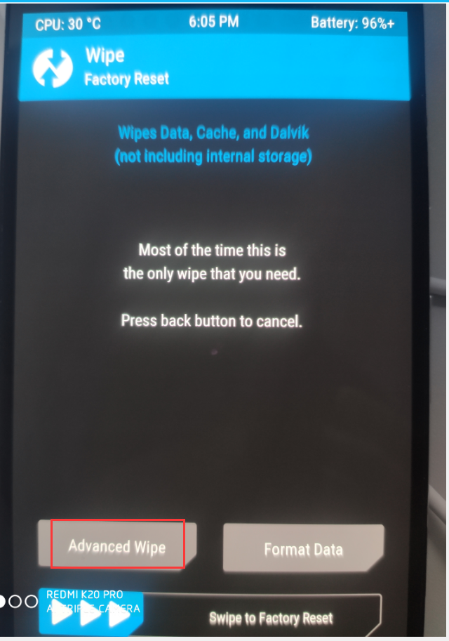<br/>
<br/>
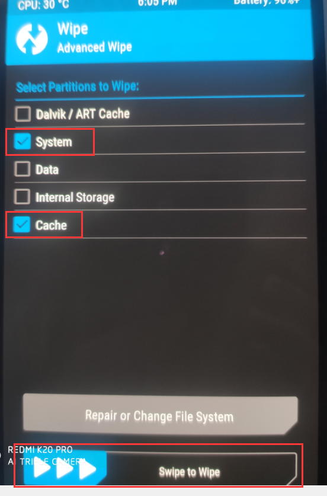<br/>
6.返回到开始界面，Advanced -> ADB Sideload<br/>
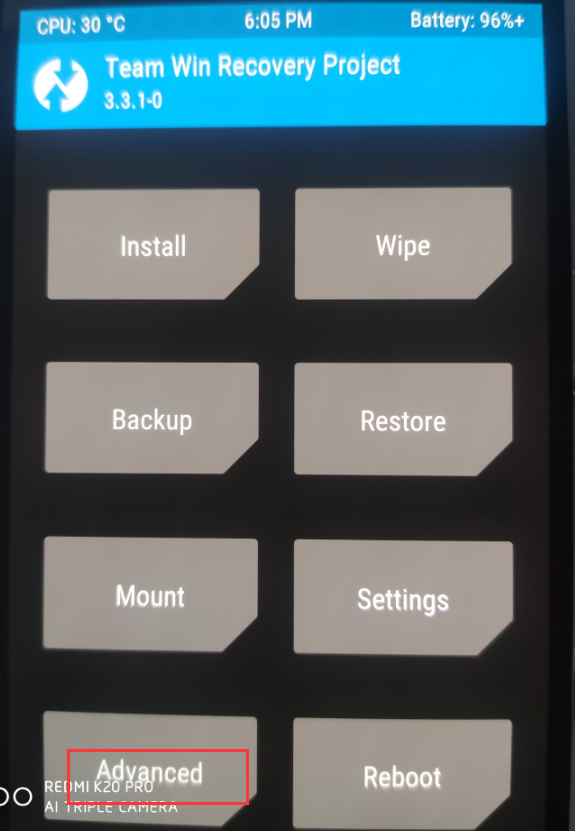<br/>
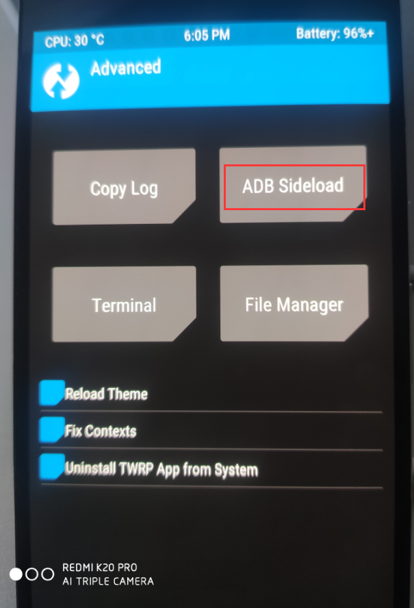<br/>
7.开始刷机<br/>
```
adb sideload lineage-15.1-20200217-nightly-angler-signed.zip
```
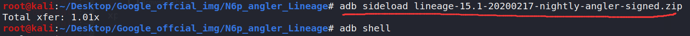<br/>
8.等待刷机结束之后，返回开始菜单<br/>
9.重复第6步的操作Advanced -> ADB Sideload<br/>
10.开始刷addonsu<br/>
```
adb sideload addonsu-15.1-arm64-signed.zip
```
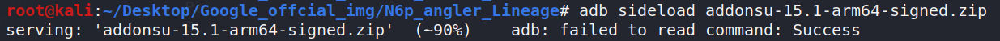<br/>

11.开机，进入 系统 -> 开发者选项 -> Root授权 ，显示下图即表示成功<br/>
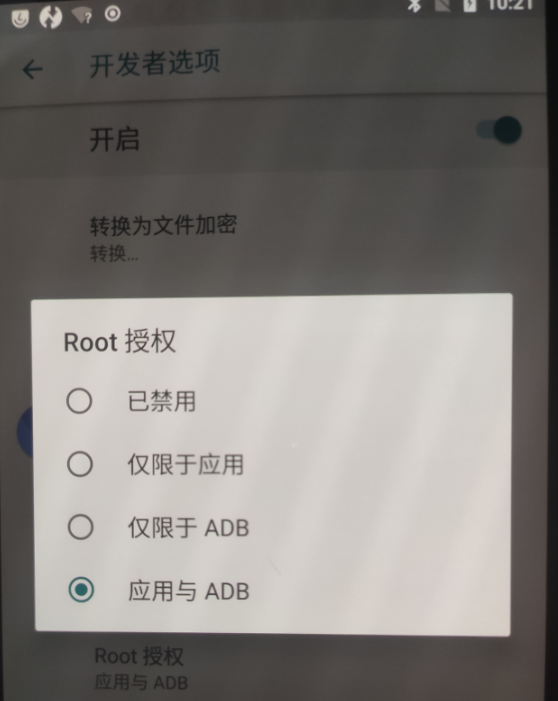<br/>


## 环境四：Pixel_sailfish_Lineage + addonsu
1.下载需要的资料<br/>
```
链接：https://pan.baidu.com/s/1Uh5wYfGaYR1wZYNBL0QFRg 
提取码：18z0
```
2.手机进入BootLoader模式，然后进入临时的twrp<br/>
```
fastboot boot twrp-3.3.0-0-sailfish.img
```
3.之后进行数据的清除，与环境三中的第4和第5步一样<br/>
```
Wipe -> Format Data -> yes
Wipe -> Advanced Wipe -> System , Cache -> Swipe to Wipe
```
4.把Lineage镜像传递到sdcard上<br/>
```
adb push lineage-16.0-20200404-nightly-sailfish-signed.zip /sdcard
```
5.使用twrp的install功能进行安装，参考环境一刷Magisk的过程<br/>
6.刷addonsu和刷Lineage镜像一样，参考环境一刷Magisk的过程<br/>

## 环境五：N6p_angler_8_1_0_r1 + supersu + nethunter
所需资料
```
链接：https://pan.baidu.com/s/1Pkv1tCCl8NPZok2-1Sc5rA 
提取码：ksu1
```
1.解压镜像包，手机进入BootLoader模式，使用./flush-all.sh命令进行刷机，但是可能出现以下错误<br/>
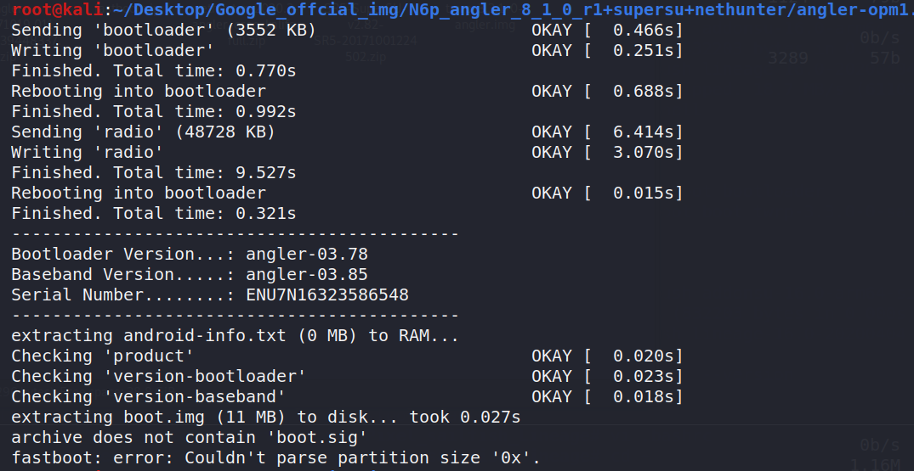<br/>
原因是**我们的fastboot太新了，需要替换一个旧的fastboot**<br/>
使用which命令找到fastboot的位置，然后替换成我百度云盘里面提供的fastboot(注意要解压)，替换完之后记得添加执行权限<br/>
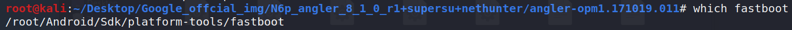<br/>
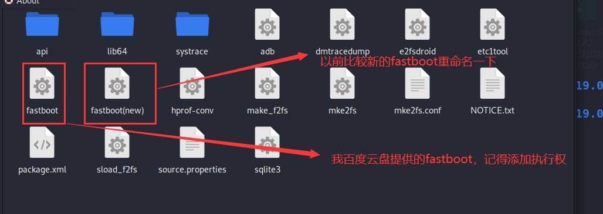<br/>

2.替换完fastboot之后再进行刷机就没啥问题了<br/>
3.刷supersu参考环境一刷Magisk的过程<br/>
4.刷NetHunter其实也是一样的，先下载刷机包<br/>
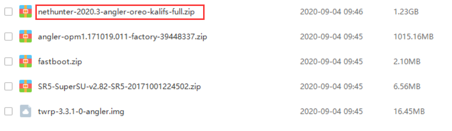<br/>
5.然后手机进入BootLoader，接着进入临时的twrp，再把NetHunter的刷机包传递到sdcard下，最后使用twrp的install功能进行安装，也就是和环境一刷Magisk的过程一样<br/>

#### NetHunter初始化
刷完毕NetHunter之后，需要初始化才能使用<br/>
```
NetHunter -> Kali Chroot Manager -> START KALI CHROOT
```
<br/>
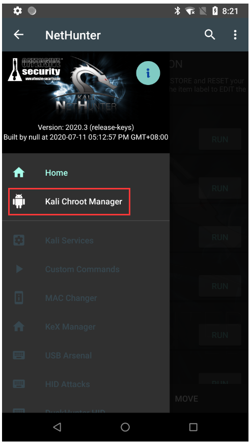<br/>
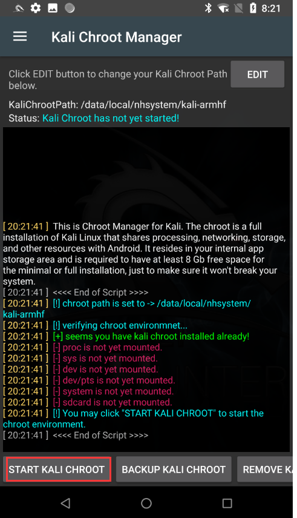<br/>


#### NetHunter配置桌面
可以参考这篇文章<br/>
```
https://www.kali.org/docs/nethunter/nethunter-kex-manager/
```
1.设置本地服务器<br/>
```
KeX Manager -> SETUP LOCAL SERVER -> 设置密码 -> START SERVER
START SERVER之后可以看到Kex Server Status的状态是RUNNING，如果设置之后不是RUNNING可以刷新试下
```
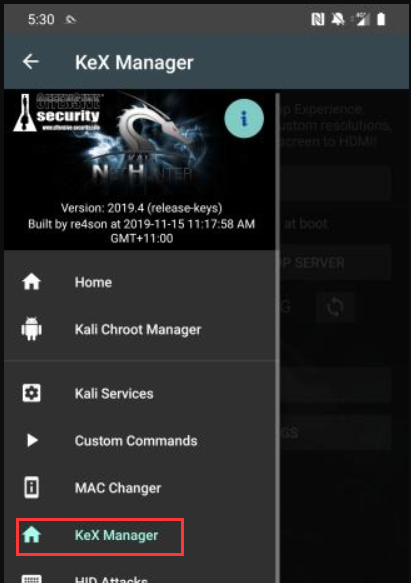<br/>
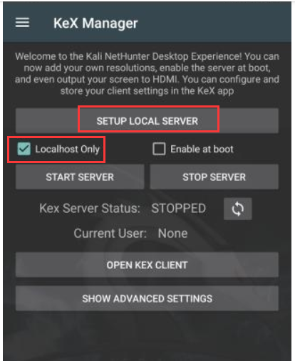<br/>
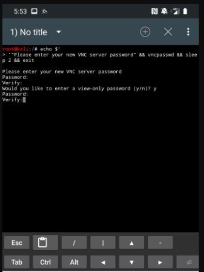<br/>
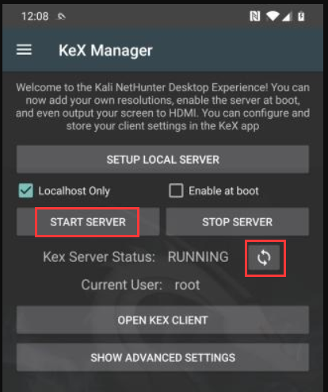<br/>

2.连接本地服务器<br/>
```
NetHunter Kex -> 设置VNC Connection Settings -> Connect
```
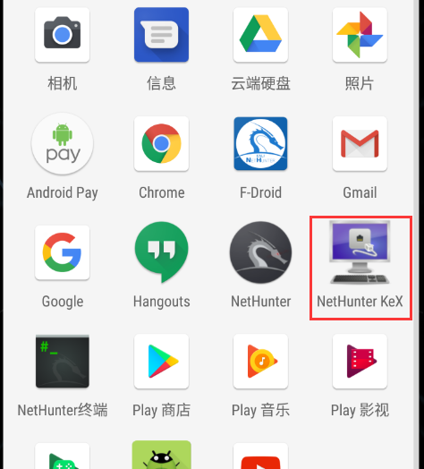<br/>
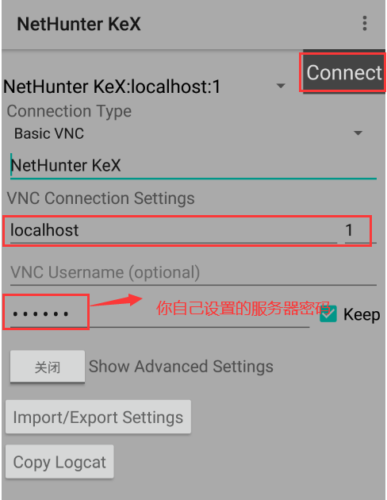<br/>
大功告成！！！<br/>
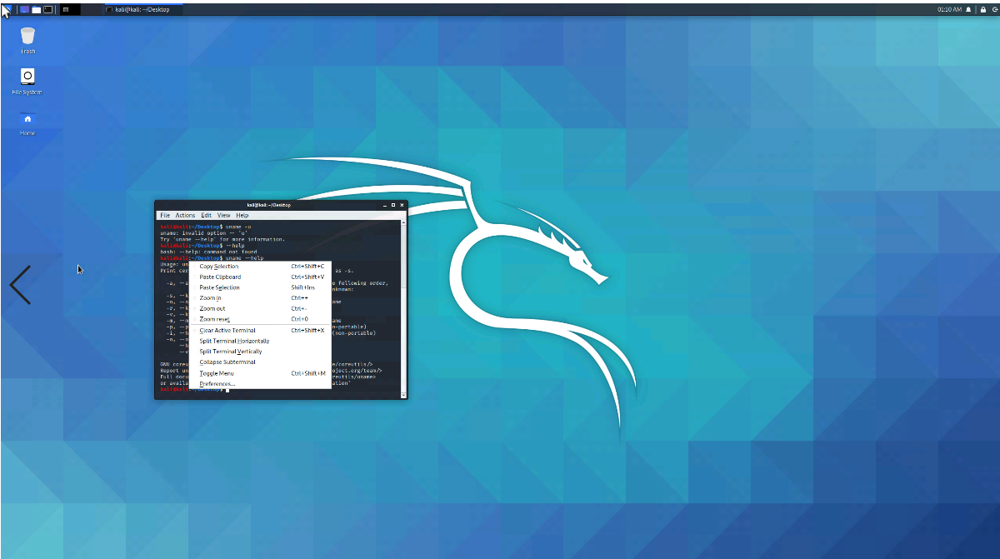<br/>


## 总结
1.刷机要下载正确的镜像，正确的twrp，什么是正确的呢？就是镜像包，twrp都要符合你手机的型号<br/>
1.镜像包有了之后，直接**运行./flush-all.sh命令**就可以进行刷机了，可能出现问题就是fastboot太新的原因，替换成一个旧的fastboot就可以了<br/>
2.刷SuperSu，Magisk，Nethunter其实步骤都是一样的，都是**上传到sdcard，然后手机进入临时twrp，使用install功能进行安装**就行了<br/>
3.这里我推荐使用临时的twrp，不要把twrp刷成永久的，因为我的pixel刷永久的twrp之后，好几次都开不了机，所以最好还是使用临时的twrp<br>


