## HTTPS/HTTP抓包原理解析
### 基本原理
1.HTTPS/HTTP抓包的根本原理就是中间人攻击，举一个不恰当的比喻就是类似于我们现实生活中的通过中介租房。<br/>
2.在现实生活中，我们通过中介租房，是不会直接和房东交互的，我们把钱交给中介，而房东把钥匙交给中介。也就是说中介同时对我们自己和房东进行交互，也就形成了两个会话。<br/>
3.和租房类似，HTTPS/HTTP抓包在客户端和服务器之间也存在一个第三者，也就是我们的Charles。Charles对客户端说，我是服务器你把数据发给我，然后再对服务器说，我是客户端，你也把数据发送给我，这样就形成了中间人攻击。<br/>

### 客户端校验服务器证书
1.对于HTTP来说，我们只要在服务器和客户端之间架设一个第三者就可以开始进行抓包了。但是，HTTPS提高了安全策略，用到了证书这个东西。<br/>
2.用大白话来讲，Charles骗客户端说我是服务器，客户端说，你说你是服务器，那拿证据出来证明一下。这时候，Charles拿出自己的证书给客户端看，客户端有一个表，里面保存着所有他信任的证书。然后客户端一查，Charles的证书并不在里面，所以就识别了Charles的伪装，知道Charles是骗自己的，那么就不会发送数据给Charles。<br/>

### 服务器校验客户端证书
1.原理和上面客户端校验服务器证书类似，也是服务器保存着他信任的证书，只要发送给服务器的证书并没有在他的信任列表里面，那么服务器就不会认为它是真正的客户端。<br/>

### 总结
借用一下肉丝大佬的图<br/>
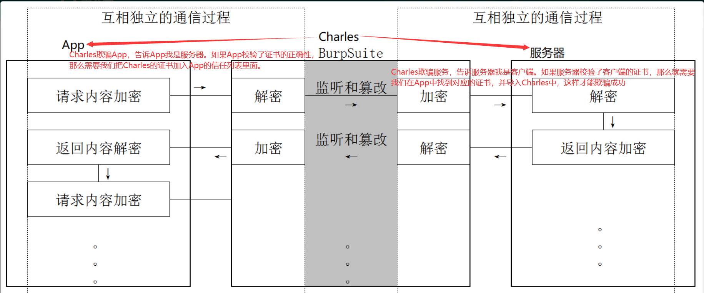<br/>


## 使用Charles+Postern抓包的优势
1.SOCKS协议位于传输层(TCP/UDP等)与应用层之间，所以能代理TCP和UDP的网络流量。<br/>
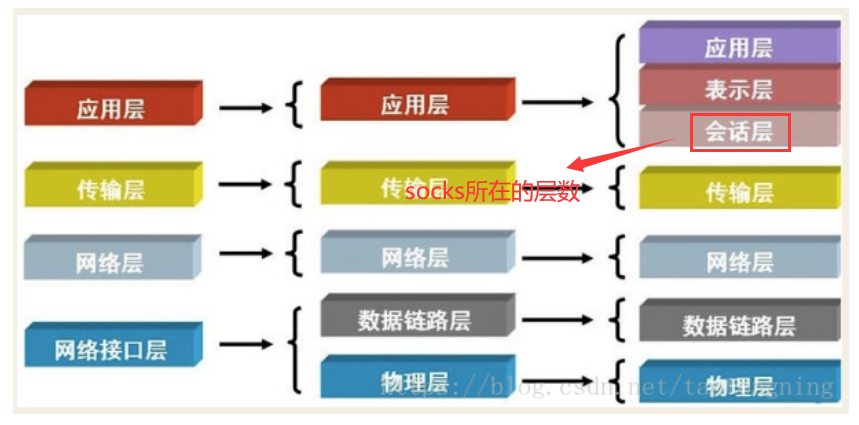<br/>
2.又因为SOCKS协议处于会话层，所以表示层，应用层的流量都可以抓取。比如说：HTTP，HTTPS。<br/>
3.记住肉丝大佬的话，当我们在聊IP的时候代表的是网络层，当我们在聊端口的时候是传输层，再往上才是协议，比如说：SOCK5，HTTP，HTTPS<br/>
4.因为当时我们使用Postern之后，会在手机里面新建一个网络接口，而所有基于IP的流量都会通过这个新的网络接口，这样我们抓包就下降到了网络层，也就是说，网络层以上的数据我们都能抓了。这就是使用Postern的强大之处。<br/>
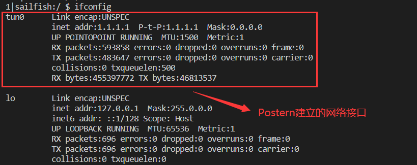<br/>
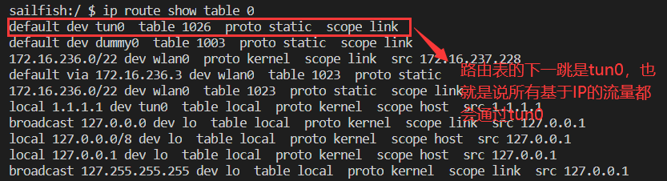<br/>

## 安装Charles
1.访问Charles官网下载win版本之后进行安装<br/>
```
https://www.charlesproxy.com/latest-release/download.do
```
2.根据下载包的版本，访问破解Charles的网站，下载破解包<br/>
```
https://www.zzzmode.com/mytools/charles/
```
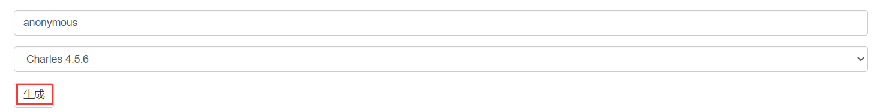<br/>
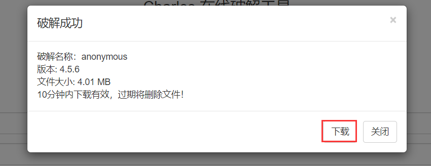<br/>
3.切换到Charles根目录下的lib文件夹，把刚才下载下来的破解包替换掉charles.jar这个文件<br/>
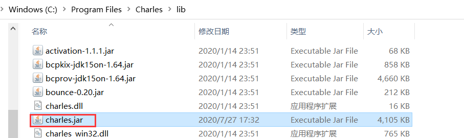<br/>

4.运行Charles，选择help -> about charles<br/>
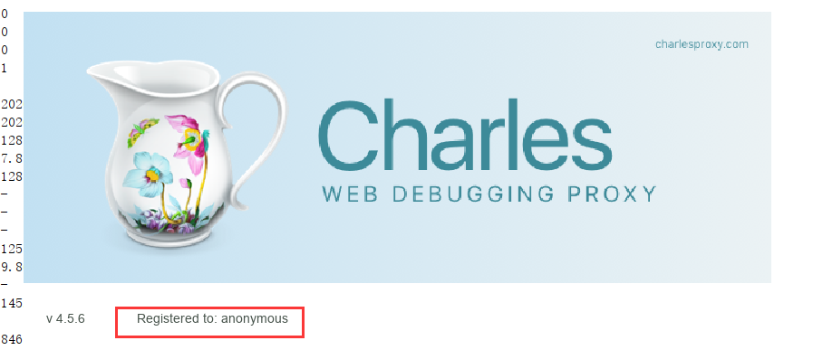<br/>
显示上图字样，表示破解成功<br/>


## 设置Charles
1.开启socks代理<br/>
```
Proxy -> ProxySettings
```
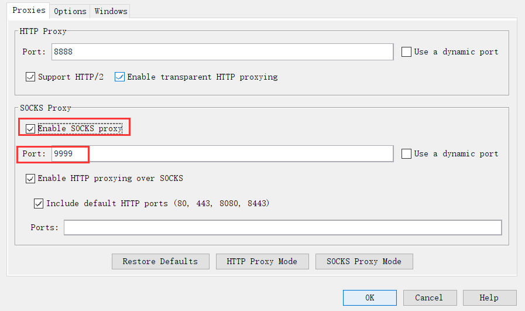<br/>
2.SSL Proxying Settings设置，*:*表示匹配任意地址和端口<br/>
```
Proxy -> SSL Proxying Settings
```
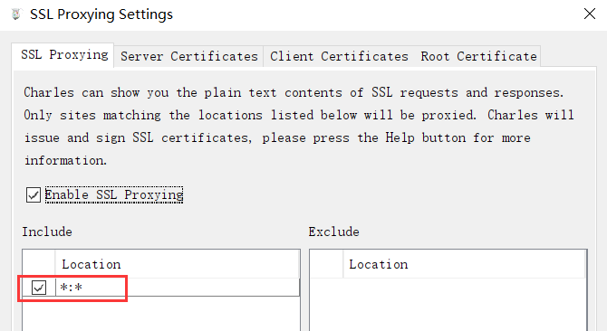<br/>

## 设置Postern
1.先设置Proxy<br/>
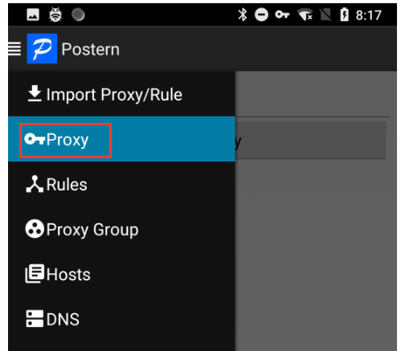<br/>
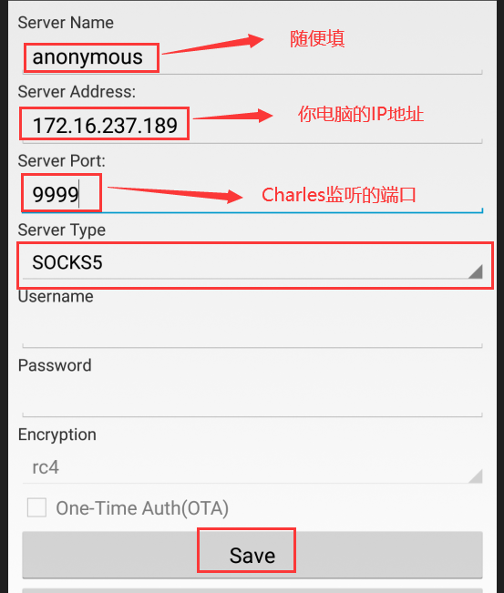<br/>
2.再设置Rules<br/>
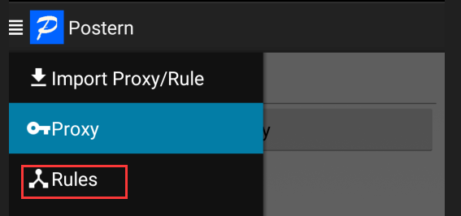<br/>
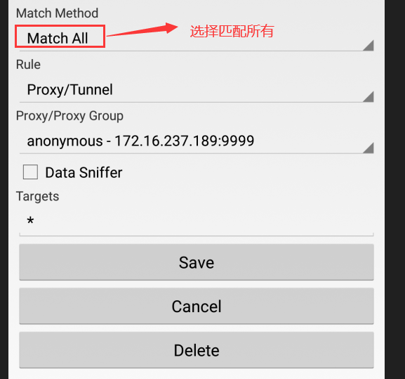<br/>
3.上面设置完成之后，Charles会弹出一个窗口，选择Allow即可
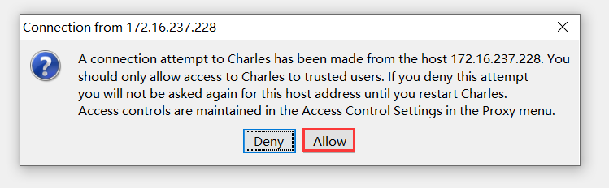<br/>
经过上面的设置，我们就可以抓HTTP的包了<br/>


## 过客户端检验服务器证书
1.访问charles证书地址进行下载，然后安装至手机。<br/>
```
chls.pro/ssl
```
安装完成之后，这个证书文件位于/data/misc/user/0/下
2.把下载下来的证书导入到手机的根证书中，然后使用adb进入手机shell。<br/>
```
cd /data/misc/user/0/cacerts-added
mount -o remount,rw /
cp * /etc/security/cacerts/
```
3.注意有的APP还会在代码中对服务器证书进行校验，这时候就需要我们逆向分析APP找出校验证书的地方通过Hook或者重打包过掉证书检测。<br/>

## 过服务器校验客户端证书
1.注意这里的客户端证书需要你们自己分析目标App找出来。<br/>
2.打开Charles，导入逆向分析出来的客户端证书。<br/>
```
1.Proxy -> SSL Proxying Settings -> Client Certificates -> Add -> 导入证书 
2.设置Host和Port为*
```
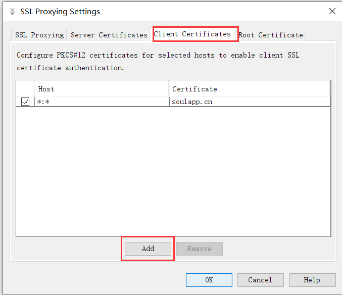<br/>
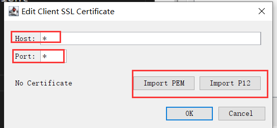<br/>


## 总结
1.HTTP和HTTPS的抓包原理都是中间人攻击<br/>
2.过客户端校验服务器证书需要把Charles的证书至于手机的根证书列表中，有的时候还需要分析App过掉里面的代码证书检测<br/>
3.过服务器检验客户端证书需要我们逆向分析出App的客户端证书，并把它导入进Charles中<br/>

***

以上用到的资料在公众号内(和我一起学逆向)回复"抓包环境"即可获取。放一张公众号的的二维码。<br/>
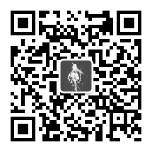<br/>
