# 虚拟机环境搭建
## 下载虚拟机
```
链接：https://pan.baidu.com/s/1y4jkjcva8q_egbHIdaVtSQ 
提取码：o0ug 
```
下载种子之后，使用VMware打开即可，**用户名为：root，密码为：toor**<br/>


## 修正时间不对
```
# dpkg-reconfigure tzdata
然后选择Asia→Shanghai，然后重启即可
```
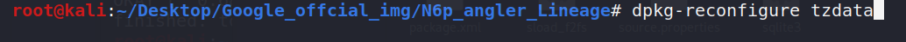<br/>
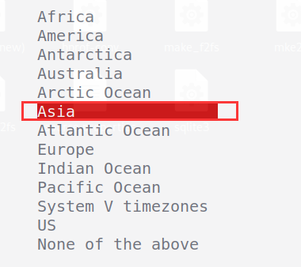<br/>
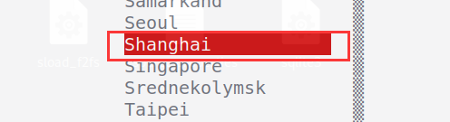<br/>

## 安装常用软件
先运行**apt update**命令更新一下软件源<br/>
### htop
```
作用 : 查看任务情况 ， 相当于任务管理器
安装 : apt install htop
使用 : htop
```
<br/>

### jnettop
```
作用 : 查看实时的流量情况
安装 : apt install jnettop
使用 : jnettop
```
可能出现以下错误<br/>
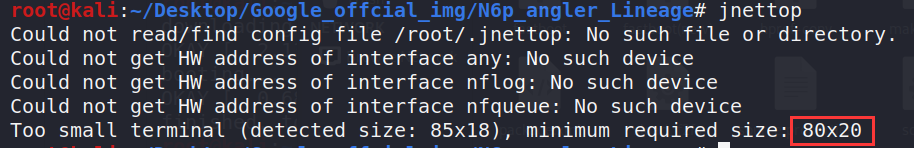<br/>
调大窗口即可，或者最大化窗口即可<br/>
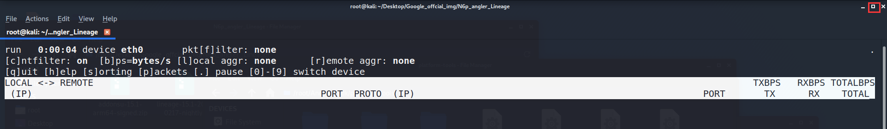<br/>

### iotop
```
作用 : 查看读写情况
安装 : apt install iotop
使用 : iotop
```

## 解决中文乱码
```
apt install xfonts-intl-chinese
apt install ttf-wqy-microhei
```

## 增加命令的历史记录
```
vi ~/.bashrc -> 修改HISTSIZE和HISTFILESIZE
```
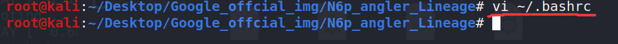<br/>
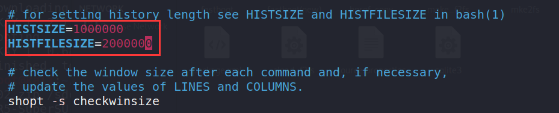<br/>


## 配置proxychains
1.首先你需要一个SSR，也就是我们常说的小飞机<br/>
<br/>


2.查看物理机的ip地址<br/>
```
ipconfig
```
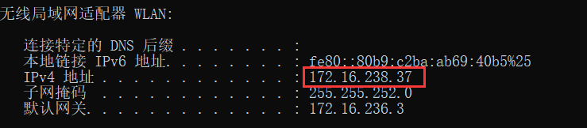<br/>
这里我的ip地址是172.16.238.37，然后去虚拟机kali里面看看能不能ping通这个地址<br/>
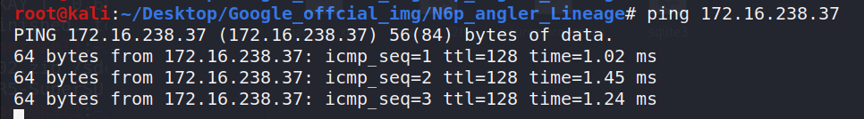<br/>
这里我们看到可以ping通，如果你的不能ping通，那么你就要去网上找下不能ping通的原因，因为我们的代理在物理机上，如果ping不通是无法通过ssr科学上网的。一般ping不通的原因就是开启了防火墙，把防火墙关掉试试，如果还不行就上百度去解决<br/>

3.配置proxychains的配置文件<br/>
```
vi /etc/proxychains.conf -> 设置代理
```
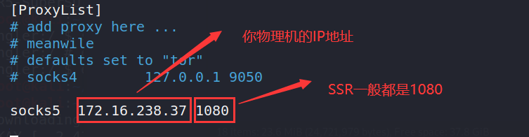<br/>
为防止下载的时候报错，我们注释掉下面这个选项<br/>
<br/>

4.SSR配置<br/>
选中小飞机，然后右键，选择**选项设置**<br/>
<br/>
勾选**允许来自局域网的连接**<br/>
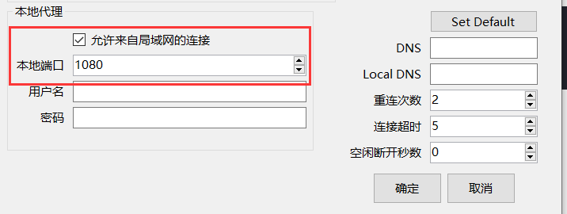<br/>

5.测试是否配置成功<br/>
```
proxychains wget https://images.kali.org/nethunter/nethunter-2020.3-angler-oreo-kalifs-full.zip

jnettop(使用jnettop查看实时流量信息)
```
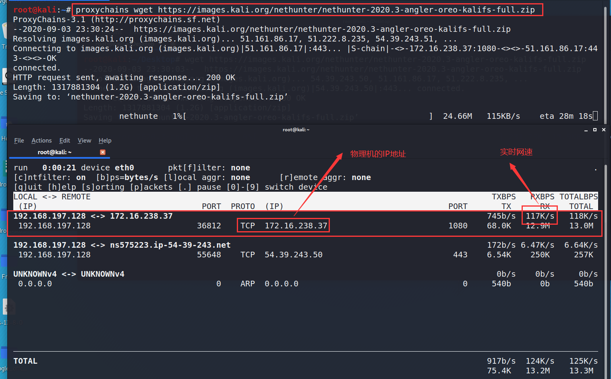<br/>
从图中可以看到，流量都被转发到了172.16.238.37这个IP地址，也就是我们物理机的IP地址，所以配置成功！！！<br/>


## 删除复制粘贴的缓存
```
cd ~/.cache/vmware/drag_and_drop
du -h -d1(查看缓存文件信息)
rm -rf *
```
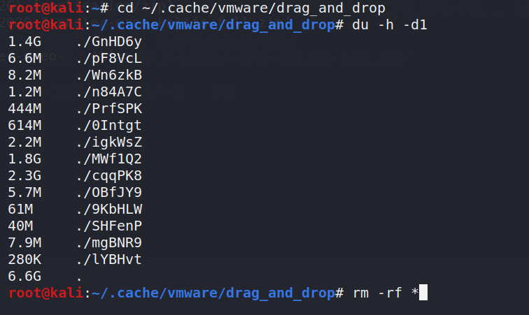<br/>


